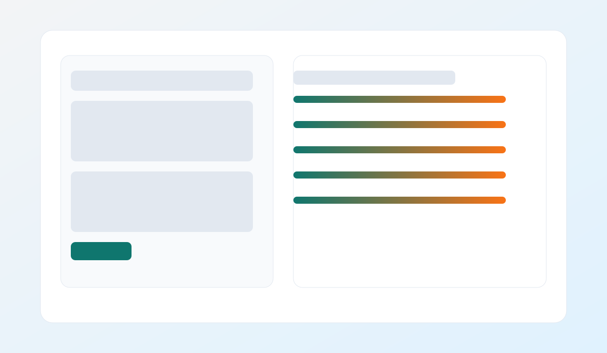

# AI-Powered Resume Analyzer & Job Matcher

The AI-Powered Resume Analyzer & Job Matcher is an NLP-driven tool that compares a resume against a job description, computes an ATS-style match score, and provides keyword + bullet suggestions to improve alignment.


## Features
- ATS-style similarity scoring with TF-IDF + semantic signals
- Missing keyword extraction for targeted improvements
- Suggested keywords and resume bullets
- Live web UI with match breakdown and exports
- CLI mode with JSON output and config support
- Sample inputs + resume template

## Preview


## Tech Stack
- Python
- scikit-learn
- FastAPI

## Run (Interactive CLI)
```
python -u .\resume.py\resume.py
```

## CLI Usage
```
python -u .\resume.py\resume.py --resume-file .\examples\resume_sample.txt --jd-file .\examples\job_description_sample.txt
python -u .\resume.py\resume.py --resume-file .\examples\resume_sample.txt --jd-file .\examples\job_description_sample.txt --format json
python -u .\resume.py\resume.py --resume-text "My resume text" --job-description "My JD" --output report.txt
```

## Config (Optional)
Create a JSON file like `config.example.json` and point to it:
```
python -u .\resume.py\resume.py --resume-file .\examples\resume_sample.txt --jd-file .\examples\job_description_sample.txt --config .\config.example.json
```

## Web App
```
uvicorn main:app --reload
```

Open `http://127.0.0.1:8000` in your browser and use the UI to analyze resumes, load samples, or export results.

## Development
```
python -m pip install -r requirements.txt -r requirements-dev.txt
python -m ruff check .
python -m black . --check
python -m pytest -q
```

## Environment
You can set `RESUME_ANALYZER_CONFIG` to point to a JSON config file:
```
RESUME_ANALYZER_CONFIG=./config.example.json
```

## Docs
- `docs/architecture.md`
- `docs/api.md`
